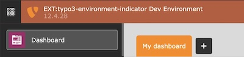
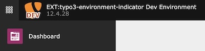
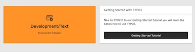

<div align="center">


# TYPO3 extension `typo3_environment_indicator`

[](https://extensions.typo3.org/extension/typo3_environment_indicator)
[](https://extensions.typo3.org/extension/typo3_environment_indicator)
[](https://coveralls.io/github/jackd248/typo3-environment-indicator)
[](https://github.com/jackd248/typo3-environment-indicator/actions/workflows/cgl.yml)
[](https://github.com/jackd248/typo3-environment-indicator/actions/workflows/tests.yml)
[](LICENSE.md)

</div>

This extension provides several features to show an environment indicator in the TYPO3 frontend and backend.

| Preview                                                                                | Feature                                                                                                                                                                                                                                                                      | Frontend | Backend |
|----------------------------------------------------------------------------------------|------------------------------------------------------------------------------------------------------------------------------------------------------------------------------------------------------------------------------------------------------------------------------|----------|---------|
|                | **[Frontend hint](https://docs.typo3.org/p/konradmichalik/typo3-environment-indicator/main/en-us/Indicators/FrontendHint.html)** <br/><br/> Adds an informative hint to the frontend showing the website title and the current application context.                          | ✔️       |         |
|  | **[Backend toolbar item](https://docs.typo3.org/p/konradmichalik/typo3-environment-indicator/main/en-us/Indicators/BackendToolbar.html)** <br/><br/> Adds an informative item with the current application context to the backend toolbar.                                   |          | ✔️      |
|              | **[Backend topbar](https://docs.typo3.org/p/konradmichalik/typo3-environment-indicator/main/en-us/Indicators/BackendTopbar.html)** <br/><br/> Colorize the backend header topbar regarding the application context.                                                          |          | ✔️      |
|                            | **[Modified favicon](https://docs.typo3.org/p/konradmichalik/typo3-environment-indicator/main/en-us/Indicators/Favicon.html)** <br/><br/> Modify the favicon for frontend and backend based on the original favicon, the current application context and your configuration. | ✔️       | ✔️      |
|                  | **[Modified backend logo](https://docs.typo3.org/p/konradmichalik/typo3-environment-indicator/main/en-us/Indicators/BackendLogo.html)** <br/><br/> Modify the backend logo based on the original logo, the current application context and your configuration.               |          | ✔️      |
|          | **[Dashboard widget](https://docs.typo3.org/p/konradmichalik/typo3-environment-indicator/main/en-us/Indicators/DashboardWidget.html)** <br/><br/> Render a dashboard widget according to the environment.                                                                    |          | ✔️      |
|              | **[Modified frontend image](https://docs.typo3.org/p/konradmichalik/typo3-environment-indicator/main/en-us/Indicators/FrontendImage.html)** <br/><br/> Modify frontend image based on the original image, the current application context and your configuration.            | ✔️       |         |

> [!NOTE]
> These environment indicators are mainly for development purposes (e.g. distinguishing between different test systems)
> and will not show in production environments.

## Requirements

- TYPO3 >= 11.5 & PHP 8.1+

## Installation

### Composer

[](https://packagist.org/packages/konradmichalik/typo3-environment-indicator)
[](https://packagist.org/packages/konradmichalik/typo3-environment-indicator)

Use the following composer command to install the extension:

```bash
composer require konradmichalik/typo3-environment-indicator
```

### TER

[](https://extensions.typo3.org/extension/typo3_environment_indicator)
[](https://extensions.typo3.org/extension/typo3_environment_indicator)

Download the zip file
from [TYPO3 extension repository (TER)](https://extensions.typo3.org/extension/typo3_environment_indicator).

## Documentation

Please have a look at the
[official extension documentation](https://docs.typo3.org/p/konradmichalik/typo3-environment-indicator/main/en-us/Index.html).

## Migration from version 1.x to 2.x

Since version 2.x, the extension is using the new `Handler::addIndicator` method to add the environment indicator
configuration instead of the old `ConfigurationUtility::configByContext` method.

## Development

Use the following ddev command to easily install all supported TYPO3 versions for locale development.

```bash
ddev install all
```

Use the `context` command to easily change the application context in all supported TYPO3 versions.

## Credits

This project is partly inspired by the [laravel-favicon](https://github.com/beyondcode/laravel-favicon) package.

## License

This project is licensed
under [GNU General Public License 2.0 (or later)](LICENSE.md).
