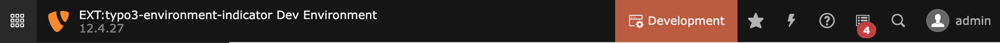

<div align="center">


# TYPO3 extension `typo3_environment_indicator`

</div>

[]()
[](LICENSE.md)

This extension provides several features to show an environment indicator in the TYPO3 frontend and backend.

| Preview                                                                         | Feature                                                                                                                                                                        |
|---------------------------------------------------------------------------------|--------------------------------------------------------------------------------------------------------------------------------------------------------------------------------|
|         | **[Frontend hint](#frontend-hint)** <br/><br/> Adds an informative hint to the frontend showing the website title and the current application context.                         |
|  | **[Backend toolbar item](#backend-toolbar-item)** <br/><br/> Adds an informative item with the current application context to the backend toolbar.                             |
|                     | **[Modified favicon](#favicon)** <br/><br/> Modify the favicon for frontend and backend based on the original favicon, the current application context and your configuration. |

> [!NOTE]  
> These environment indicators are mainly for development purposes (e.g. distinguishing between different test systems)
> and will not show in production environments.

## Requirements

* TYPO3 >= 11.5 & PHP 8.1+
* ImageMagick
    * Required for the ICO file modification

## Installation

### Composer

```bash
composer require konradmichalik/typo3-environment-indicator
```

### Configuration

Include the static TypoScript template "Environment Indicator" or directly import it in your sitepackage:

```typoscript
@import 'EXT:typo3_environment_indicator/Configuration/TypoScript/setup.typoscript'
```

### Extension settings

You can enable and disable every single feature in the extension settings.

## Frontend hint

The frontend hint will show the current application context information and the website title as clickable note in the
upper right corner.


You can adjust the color of the hint in your `ext_localconf.php`:

```php
$GLOBALS['TYPO3_CONF_VARS']['EXTENSIONS']['typo3_environment_indicator']['context']['Development']['frontendHint'] => [
    'color' => '#bd593a',
]
```

## Backend toolbar item

The backend toolbar item will show the current project version and application context.



You can adjust the color of the toolbar item in your `ext_localconf.php`:

```php
$GLOBALS['TYPO3_CONF_VARS']['EXTENSIONS']['typo3_environment_indicator']['context']['Development']['backendToolbar'] => [
    'color' => '#bd593a',
]
```

## Favicon

The favicon of the frontend or backend context will be modified regarding the application context and the associated
configuration.

For the **frontend**, the original favicon will either be fetched from the typoscript configuration
`page.shortcutIcon` (
see [typoscript reference](https://docs.typo3.org/m/typo3/reference-typoscript/main/en-us/Guide/Page/Index.html#guide-page-favicon))
or can be handled by your own fluid template via the [FaviconViewHelper](Classes/ViewHelpers/FaviconViewHelper.php):

```html

<html xmlns:f="http://typo3.org/ns/TYPO3/CMS/Fluid/ViewHelpers"
      xmlns:ei="http://typo3.org/ns/KonradMichalik/Typo3EnvironmentIndicator/ViewHelpers"
      data-namespace-typo3-fluid="true">

{f:uri.resource(path:'EXT:your_extension/Resources/Public/Favicon/favicon.png') -> ei:favicon()}
```

For the **backend**, the favicon will be fetched by the extension configuration of
`$GLOBALS['TYPO3_CONF_VARS']['EXTENSIONS']['backend']['backendFavicon']`.


### Modification

The favicon modification configuration can be found in
`$GLOBALS['TYPO3_CONF_VARS']['EXTENSIONS']['typo3_environment_indicator']`.

Add a configured favicon modifier to the desired application context (e.g. `Testing`) in your `ext_localconf.php`:

```php
$GLOBALS['TYPO3_CONF_VARS']['EXTENSIONS']['typo3_environment_indicator']['context']['Testing']['favicon'] => [
    \KonradMichalik\Typo3EnvironmentIndicator\Image\TextModifier::class => [
        'text' => 'TEST',
        'color' => '#f39c12',
        'stroke' => [
            'color' => '#ffffff',
            'width' => 3,
        ],
    ]
]
```


The modifiers will be executed one after the other. You can combine them if you want.

The following modifier classes are available:

#### [TextModifier](Classes/Image/TextModifier.php)

> This is the default modifier if no own configuration is set.

```php
$GLOBALS['TYPO3_CONF_VARS']['EXTENSIONS']['typo3_environment_indicator']['context']['Development']['favicon'] => [
    \KonradMichalik\Typo3EnvironmentIndicator\Image\TextModifier::class => [
        'text' => 'DEV',
        'color' => '#bd593a',
        'stroke' => [
            'color' => '#ffffff',
            'width' => 3,
        ],
    ]
]
```


Additional optional configuration keys:

- `font` (string): The font file path for the text. Default is
  `EXT:typo3_environment_indicator/Resources/Public/Fonts/OpenSans-Bold.ttf`.
- `position` (string): The position of the text. Default is `bottom`. Possible values are `bottom`, `top`.

<hr/>

#### [TriangleModifier](Classes/Image/TriangleModifier.php)

Adds a triangle indicator to the favicon.

```php
$GLOBALS['TYPO3_CONF_VARS']['EXTENSIONS']['typo3_environment_indicator']['context']['Development']['favicon'] => [
    \KonradMichalik\Typo3EnvironmentIndicator\Image\TriangleModifier::class => [
        'color' => '#bd593a',
    ],
]
```


Additional optional configuration keys:

- `size` (float): The percentage size of the triangle. Default is `0.7`.
- `position` (string): The position of the triangle. Default is `bottom right`. Possible values are `bottom left`,
  `bottom right`, `top left`, `top right`.

<hr/>

#### [CircleModifier](Classes/Image/CircleModifier.php)

Adds a circle indicator to the favicon.

```php
$GLOBALS['TYPO3_CONF_VARS']['EXTENSIONS']['typo3_environment_indicator']['context']['Development']['favicon'] => [
    \KonradMichalik\Typo3EnvironmentIndicator\Image\CircleModifier::class => [
        'color' => '#bd593a',
    ],
]
```


Additional optional configuration keys:

- `size` (float): The percentage size of the circle. Default is `0.4`.
- `position` (string): The position of the circle. Default is `bottom right`. Possible values are `bottom left`,
  `bottom right`, `top left`, `top right`.
- `padding` (float): The percentage padding of the circle. Default is `0.1`.

<hr/>

#### [FrameModifier](Classes/Image/FrameModifier.php)

Adds a frame around the favicon.

```php
$GLOBALS['TYPO3_CONF_VARS']['EXTENSIONS']['typo3_environment_indicator']['context']['Development']['favicon'] => [
    \KonradMichalik\Typo3EnvironmentIndicator\Image\FrameModifier::class => [
        'color' => '#bd593a',
    ],
]
```


Additional optional configuration keys:

- `borderSize` (float): The border size of the frame. Default is `5`.

<hr/>

#### [ReplaceModifier](Classes/Image/ReplaceModifier.php)

Replace the original favicon with a custom one regarding the application context.

```php
$GLOBALS['TYPO3_CONF_VARS']['EXTENSIONS']['typo3_environment_indicator']['context']['Development']['favicon'] => [
    \KonradMichalik\Typo3EnvironmentIndicator\Image\ReplaceModifier::class => [
        'path' => 'EXT:sitepackage/Resources/Public/Icons/favicon.png',
    ],
]
```


<hr/>

#### [ColorizeModifier](Classes/Image/ColorizeModifier.php)

```php
$GLOBALS['TYPO3_CONF_VARS']['EXTENSIONS']['typo3_environment_indicator']['context']['Development']['favicon'] => [
    \KonradMichalik\Typo3EnvironmentIndicator\Image\ColorizeModifier::class => [
        'color' => '#039BE5',
    ],
]
```


<hr/>

#### CustomModifier

Implement your own image modifier by extending the [AbstractModifier](Classes/Image/AbstractModifier.php) class and
implementing the [ModifierInterface](Classes/Image/ModifierInterface.php) method.

```php
<?php

namespace Vendor\YourExt\Image;

use Intervention\Image\Geometry\Factories\RectangleFactory;
use Intervention\Image\Interfaces\ImageInterface;
    
class CustomModifier extends AbstractModifier implements ModifierInterface {

    public function modify(ImageInterface &$image): void 
    {
        // Modify the image
    }

    public function getRequiredConfigurationKeys(): array 
    {
        // Return the required configuration keys
    }
}
```

See the [Intervention Image documentation](http://image.intervention.io/v3) for more information about image
manipulation.

> [!NOTE]  
> Having fun with colorful favicons? Use the [ColorUtility::getColoredString()](Classes/Utility/ColorUtility.php)
> function as color entry in your modifier configuration to generate a color based on a string (default is the
`$GLOBALS['TYPO3_CONF_VARS']['SYS']['sitename']`).

## Development

Use the following ddev command to easily install all supported TYPO3 versions for locale development.

```bash
$ ddev install
```

## Credits

This project is partly inspired by the [laravel-favicon](https://github.com/beyondcode/laravel-favicon) package.

## License

This project is licensed
under [GNU General Public License 2.0 (or later)](LICENSE.md).
